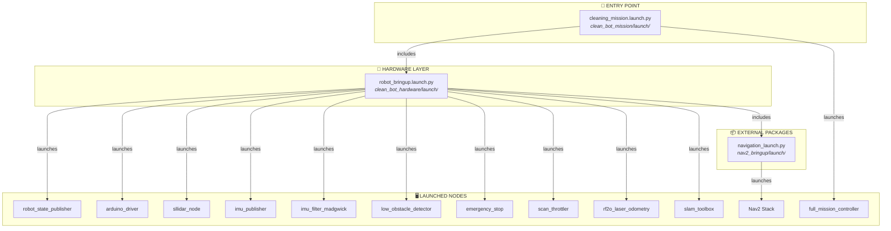
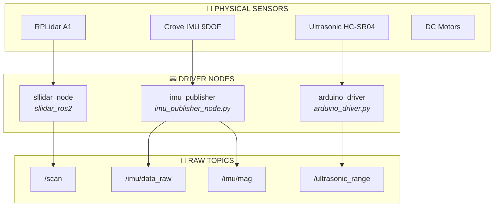
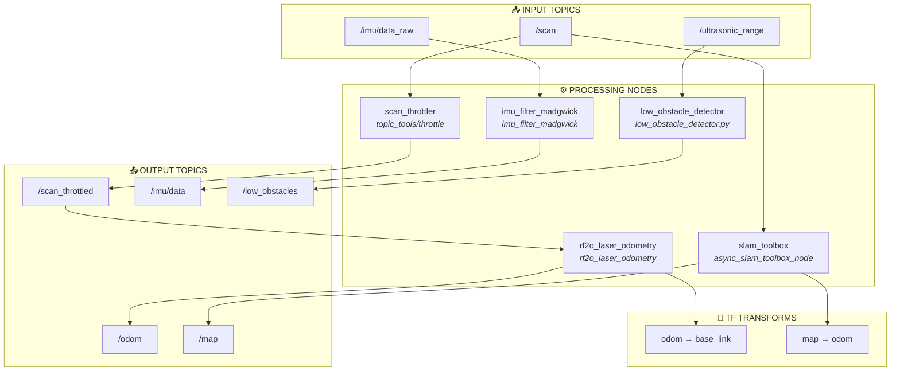
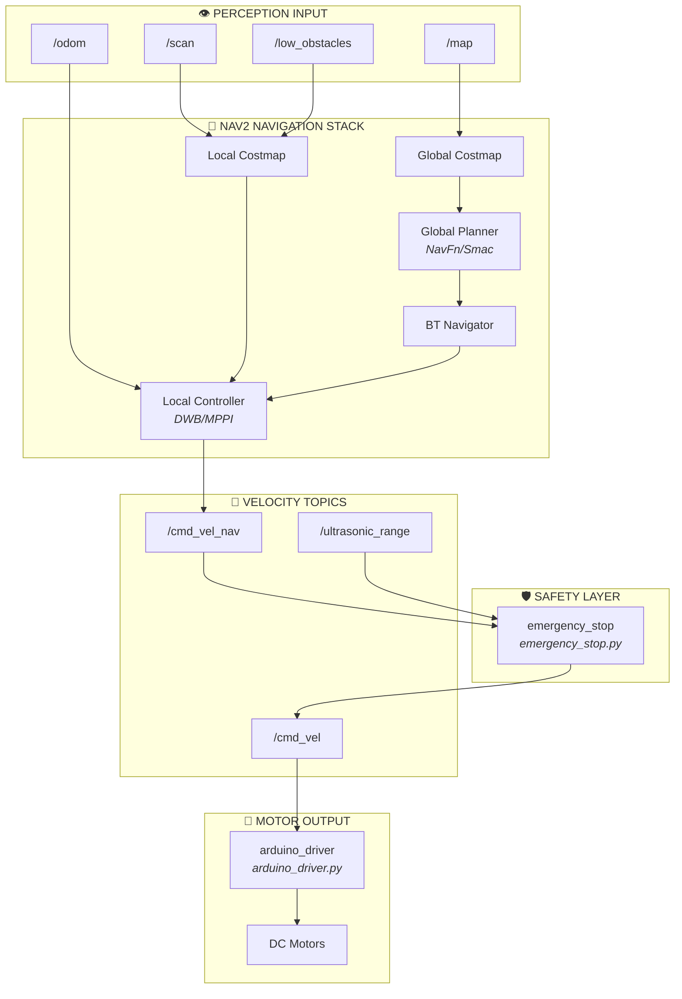
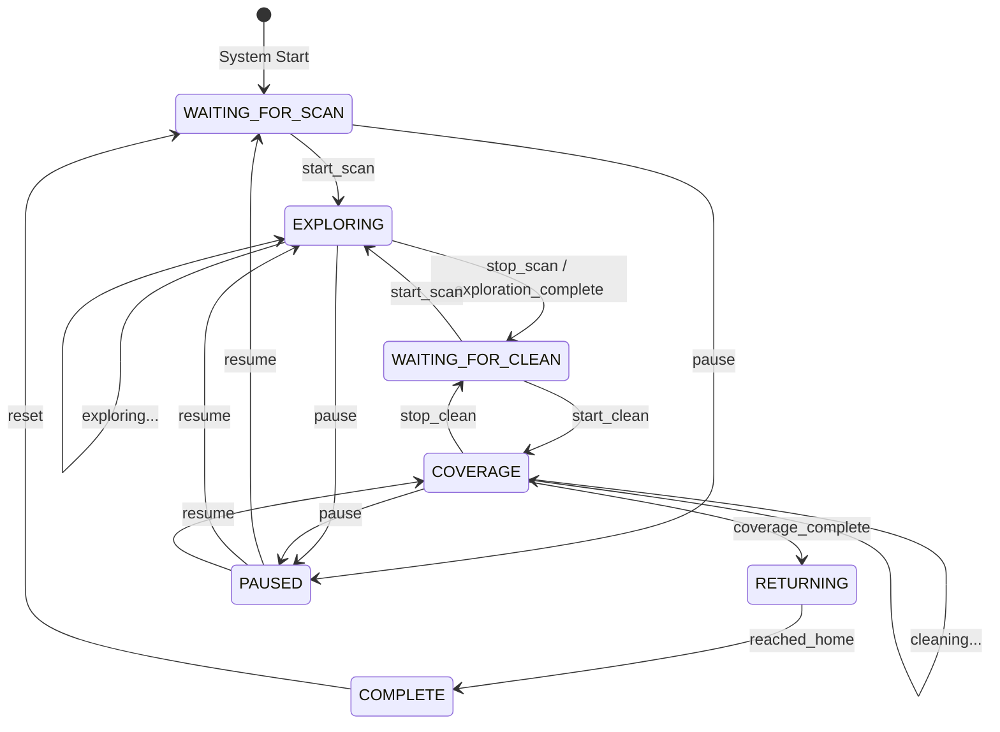
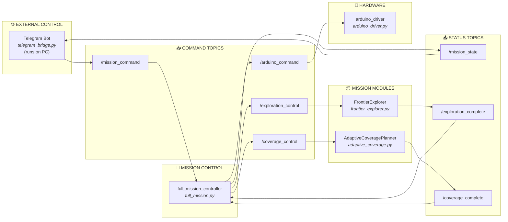
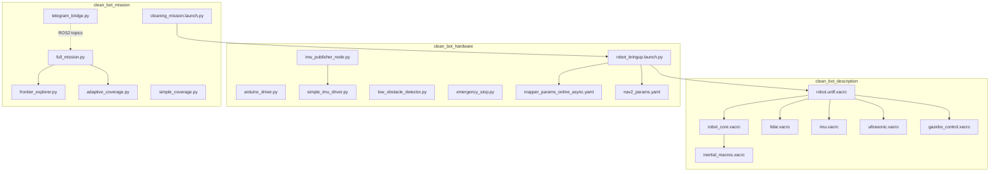
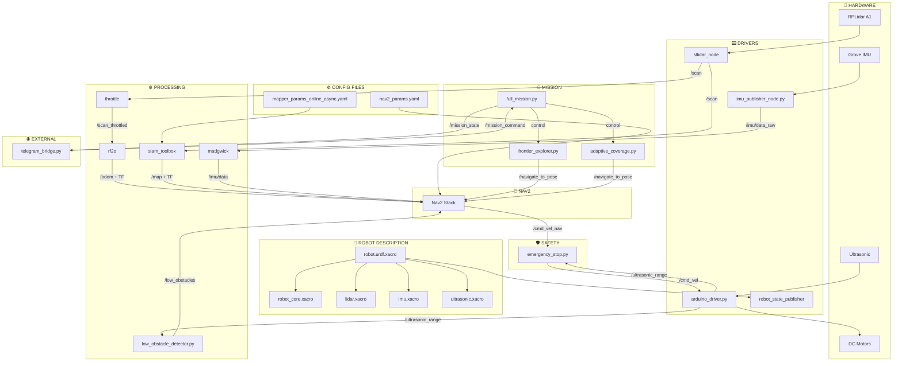
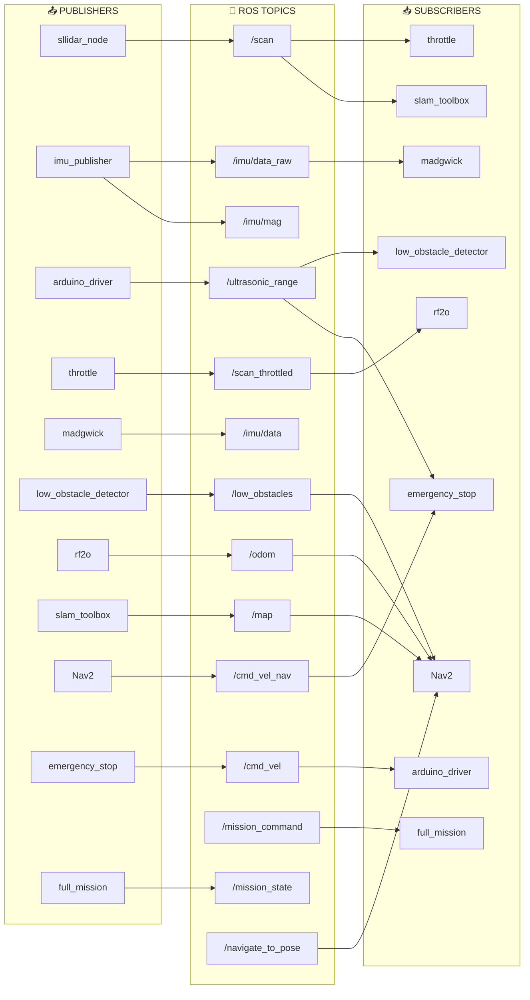

# 🤖 Clean Bot - System Flow Diagrams

Complete visual documentation of the autonomous cleaning robot project.

---

## 1. Launch File Hierarchy

Shows which launch files include which other files and what nodes they start.



---

## 2. Sensor Input Layer

How physical sensors connect to ROS2 driver nodes.



---

## 3. Sensor Processing Pipeline

How raw sensor data is processed into usable information.



---

## 4. Navigation to Motor Output Flow

How perception feeds into navigation and ultimately controls the motors.



---

## 5. Mission State Machine

The state transitions in `full_mission.py`.



**State Descriptions:**
| State | Description | Active Module |
|-------|-------------|---------------|
| WAITING_FOR_SCAN | Idle, waiting for start command | None |
| EXPLORING | Mapping the room | `frontier_explorer.py` |
| WAITING_FOR_CLEAN | Map complete, waiting for clean command | None |
| COVERAGE | Executing cleaning path | `adaptive_coverage.py` |
| RETURNING | Going back to start position | Nav2 |
| COMPLETE | Mission finished | None |

---

## 6. Mission Control Communication

How the mission controller communicates with other components.



---

## 7. File Dependencies

Which files import/include which other files.



---

## 8. Complete System Architecture

The full end-to-end data flow.



---

## 9. Complete ROS Topic Map

All topics with their publishers and subscribers.



---

## Topic Reference Table

| Topic | Message Type | Publisher | Subscriber(s) |
|-------|-------------|-----------|---------------|
| `/scan` | sensor_msgs/LaserScan | sllidar_node | throttle, slam_toolbox, Nav2 |
| `/scan_throttled` | sensor_msgs/LaserScan | throttle | rf2o |
| `/imu/data_raw` | sensor_msgs/Imu | imu_publisher | madgwick |
| `/imu/mag` | sensor_msgs/MagneticField | imu_publisher | madgwick |
| `/imu/data` | sensor_msgs/Imu | madgwick | Nav2 |
| `/ultrasonic_range` | sensor_msgs/Range | arduino_driver | low_obstacle_detector, emergency_stop |
| `/low_obstacles` | sensor_msgs/PointCloud2 | low_obstacle_detector | Nav2 costmap |
| `/odom` | nav_msgs/Odometry | rf2o | Nav2 |
| `/map` | nav_msgs/OccupancyGrid | slam_toolbox | Nav2, full_mission |
| `/cmd_vel_nav` | geometry_msgs/Twist | Nav2 | emergency_stop |
| `/cmd_vel` | geometry_msgs/Twist | emergency_stop, full_mission | arduino_driver |
| `/mission_command` | std_msgs/String | telegram_bridge | full_mission |
| `/mission_state` | std_msgs/String | full_mission | telegram_bridge |
| `/navigate_to_pose` | nav2_msgs/action | frontier_explorer, adaptive_coverage | Nav2 |

---

## TF Tree

```
map
 └── odom (published by SLAM Toolbox)
      └── base_link (published by rf2o_laser_odometry)
           ├── chassis
           │    ├── laser_frame (LiDAR)
           │    ├── imu_link (IMU)
           │    └── ultrasonic_link (Ultrasonic)
           ├── left_wheel
           ├── right_wheel
           └── caster_wheel
```

---

*Generated: March 2026*
